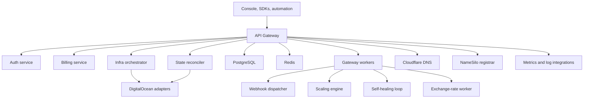

## Service map

The Nubis backend is built as a set of focused Rust services plus shared provider crates. The code in this repo shows a control plane optimized for infrastructure APIs, background orchestration, and operational visibility.

<CardGroup cols={2}>
  <Card title="API Gateway">
    Authenticated ingress, route handling, rate limiting, request metrics, and background workers for the control plane.
  </Card>
  <Card title="Auth Service">
    Exchanges upstream identity into Nubis tokens and serves JWKS metadata for verification.
  </Card>
  <Card title="Billing Service">
    Subscription state transitions, invoice generation, payment processing, and billing email workflows.
  </Card>
  <Card title="Infra Orchestrator">
    Async lifecycle operations for resource provisioning, start, stop, delete, and event-driven orchestration.
  </Card>
  <Card title="State Service">
    Drift detection and reconciliation between Nubis state and provider state.
  </Card>
  <Card title="Provider Crates">
    Shared integrations for DigitalOcean, Cloudflare DNS, NameSilo, Better Stack, and related platform dependencies.
  </Card>
</CardGroup>

## Request and orchestration flow

## What the gateway already exposes

The current gateway routes in this repo cover:

- Organizations, members, invitations, and project lifecycle.
- VMs, disks, backups, snapshots, templates, and scaling groups.
- Networks, subnets, NAT gateways, security groups, firewalls, floating IPs, and load balancers.
- DNS zones, records, domain search, registration, renewal, and domain control actions.
- Managed databases and Kubernetes clusters.
- Billing status, invoices, payment methods, credits, spend limits, and usage exports.
- API keys, audit logs, service accounts, SSO, outgoing webhooks, support tickets, and observability alerts.

## Operational design choices

- **Background-first orchestration**: long-running infrastructure changes are pushed into workers instead of blocking user requests.
- **Event-driven updates**: workers and realtime invalidation keep the Console responsive after mutations.
- **Provider abstraction**: shared crates centralize provider-specific logic so product handlers can stay focused on Nubis behavior.
- **Governance in the control plane**: IAM, billing, quotas, and support live beside infrastructure resources rather than as separate systems.
