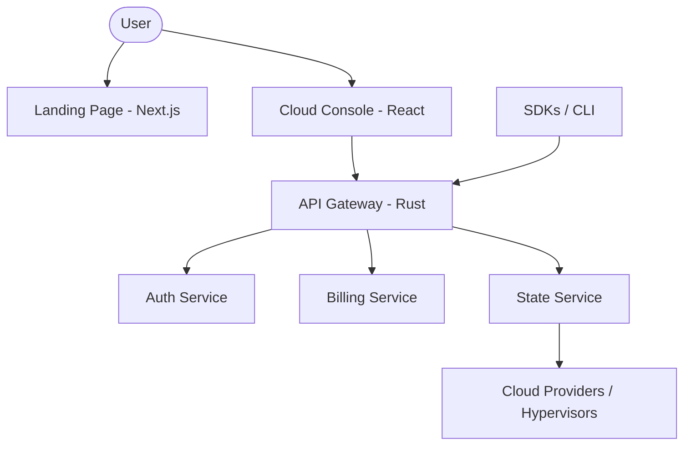

## The Nubis Ecosystem

Nubis is composed of three primary layers that work together to provide a seamless cloud experience.

### 1. Landing & Marketing (`steady-umbrella`)
Our public-facing site, built with Next.js for SEO and performance. It serves as the gateway for new users to learn about the platform, check pricing, and read our latest updates.

### 2. Cloud Console (`new-frontend`)
A powerful, React-based single-page application that serves as the primary management interface. It communicates directly with our API Gateway to provide real-time infrastructure management.

### 3. Backend Services (`services`)
The heart of Nubis, a collection of high-performance microservices primarily written in Rust.

- **API Gateway**: The entry point for all requests, handling authentication and routing.
- **Auth Service**: Manages user identity, sessions, and RBAC.
- **Billing Service**: Handles payments, usage tracking, and invoicing.
- **State Service**: Manages the distributed state of the platform.
- **Nubis Agent**: A lightweight agent running on instances for monitoring and management.

## Data Flow

## Technology Stack

- **Frontend**: React, Next.js, Tailwind CSS, TypeScript.
- **Backend**: Rust (Axum, SQLx), PostgreSQL, Redis.
- **Infrastructure**: Docker, Kubernetes, Terraform.
