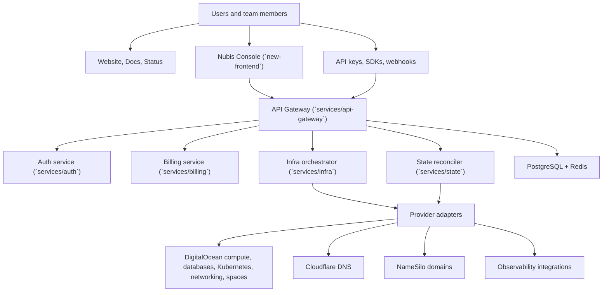

## The Nubis platform model

Nubis is a control plane for cloud infrastructure. The repo behind these docs shows three major layers working together:

- **Public surfaces** such as the marketing site, docs, API reference, and status page.
- **Operator surfaces** such as the Nubis Console, API keys, webhooks, and SDK-based automation.
- **Backend services** that authenticate requests, orchestrate resource changes, reconcile state, and process billing.

## Control plane flow

## What each layer does

### Public and operator surfaces

- `steady-umbrella` handles product marketing and public web presence.
- `docs` is the Mintlify-based documentation surface.
- `new-frontend` is the Console that operators use to manage projects, workloads, billing, and support.

### Control plane services

- `services/api-gateway` is the main ingress layer for authenticated product traffic.
- `services/auth` exchanges upstream identity into Nubis JWTs and exposes JWKS metadata.
- `services/billing` manages subscription state, invoices, and payment operations.
- `services/infra` performs asynchronous infrastructure lifecycle work.
- `services/state` reconciles desired state and actual provider state.

### Shared platform concerns

- PostgreSQL stores control-plane state, billing metadata, IAM data, tickets, domains, and audit history.
- Redis is used for fast shared state such as cache and rate-limiting support.
- Background workers handle realtime invalidation, webhook delivery, billing aggregation, scaling decisions, exchange rates, and self-healing loops.

## Why this matters for the docs

This architecture is why Nubis docs are organized around:

- **Organizations and projects** as the unit of ownership.
- **Core services** such as instances, storage, networking, databases, and Kubernetes.
- **Operations** such as observability, billing, support, and incident handling.
- **Automation** through API keys, webhooks, SDKs, and service accounts.
